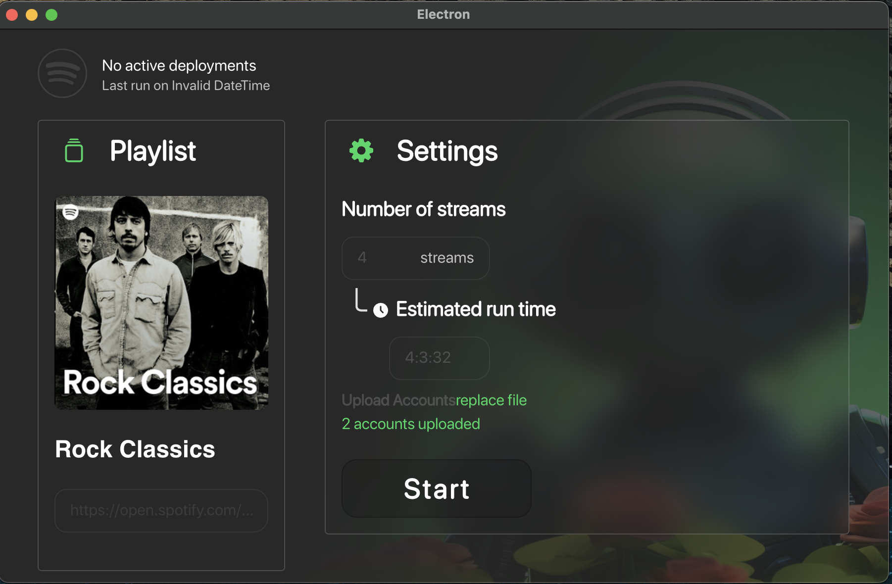

# Spotify Booster

Spotify Booster App



Are you an aspiring musician, an independent artist, or a passionate music enthusiast looking to increase the visibility
of your favorite tracks on Spotify? Look no further! Spotify Song Booster
is your ultimate companion for boosting your songs and making them stand out in the crowded world of music streaming.

### Key Features:

🔥 Boost Your Spotify Streams: Increase the number of plays for your tracks, helping them gain traction and visibility.

🚀 Enhanced Song Discoverability: Make it easier for potential listeners to discover and engage with your music.

🌐 Cross-platform Compatibility: Access and manage your campaigns from any device, anywhere.

## Getting Started:

* Fork this repository.
* Set Up Your Spotify Accounts
* Launch Your Boost: Watch your song's Spotify streams soar!

## Contributing:

We welcome contributions from the community to improve and expand the capabilities of Spotify Booster.
Feel free to open issues, submit pull requests, or suggest new features to help us
make this tool even more powerful!


## Project Setup

### Install

```bash
$ npm install
```

### Development

```bash
$ npm run dev
```

### Build

```bash
# For windows
$ npm run build:win

# For macOS
$ npm run build:mac

# For Linux
$ npm run build:linux
```

## Legal Notice:

Please note that using Spotify Song Booster must comply with Spotify's terms of service. Be responsible and respectful of their guidelines when boosting songs.

Ready to boost your Spotify tracks and share your music with the world? Join us on this journey to musical success! 🎶
